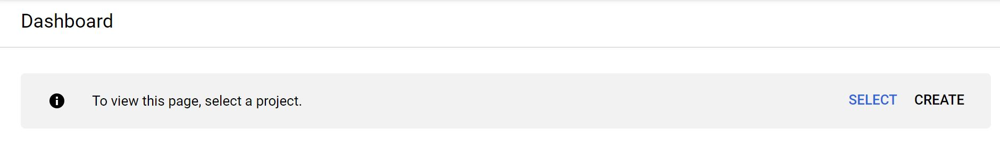
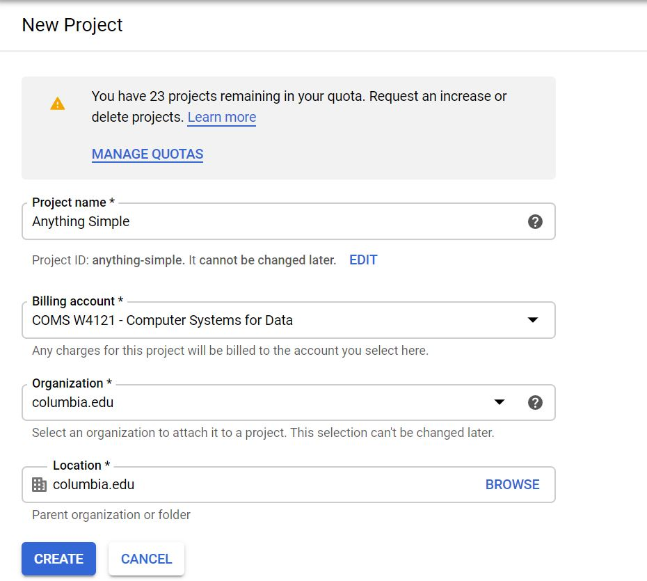
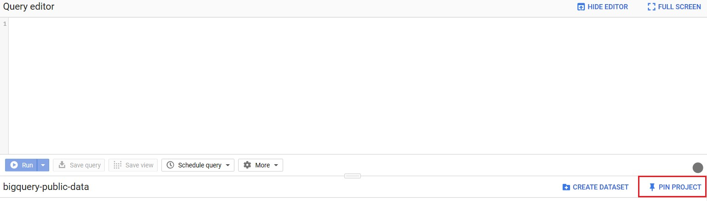
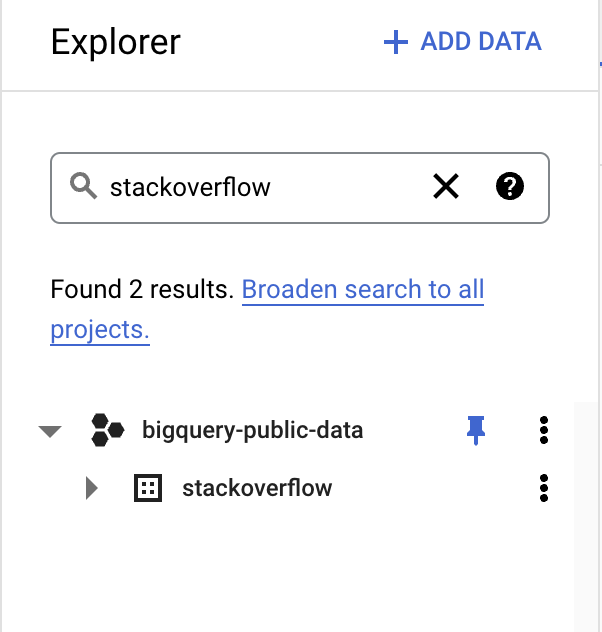
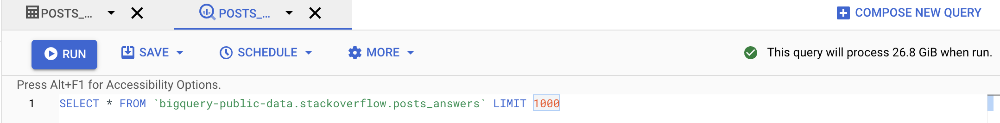

# Programming Homework 1: SQL 

Gain a hands-on understanding of Google BigQuery and SQL.

Due: **February 25, 2022 4:59:59 PM**

## Overview

Welcome to CSEE4121! This assignment will help you get familiar with the Google BigQuery platform and the SQL language.
Google has published many datasets on BigQuery -- these range from StackOverflow statistics to real-time air quality data. In this first assignment, you will be using BigQuery’s SQL interface to answer questions about the Stackoverflow Dataset. 

## Learning Outcomes

After completing this programming assignment, students should be able to:

* Write SQL queries on the Google BigQuery platform.
* Use SQL to perform a preliminary analysis of any dataset.

## Getting Started

This section will guide you through creating a BigQuery project and setting up your account so that you can query the stackoverflow dataset.


1. Make sure you have followed the [instructions](http://www.cs.columbia.edu/crf/cloud-cs/) provided by CRF to redeem your credits in Google Cloud.

2. Click this [link](https://console.cloud.google.com/projectselector2/home/dashboard?_ga=2.206924560.-2028360840.1569012083). You’ll see the page below; click “Create” to make a GCP (Google Cloud Platform) project.

3. Fill in the information to make a new project. Make sure to select the new billing account you should have after getting the class credits.

   

4. Please select the correct billing account for your new project. The billing account should be the one that you obtained from redeeming your GCP credits.

    Incase you chose the wrong billing account while creating the project, you can change the billing account later as well:

    - If you only have one billing account (obtained from redeeming your credits), then it will automatically be linked with the newly created project (in Step 3).

    - But, if you had multiple billing accounts, then it is important to link the project with the right one. Please follow the [instructions](https://cloud.google.com/billing/docs/how-to/modify-project#to_change_the_projects_account_do_the_following) mentioned to change the billing account for your project to the one created in Step 1.

5. Go to this [link](https://console.cloud.google.com/bigquery?project=bigquery-public-data&page=project), which is the page for BigQuery’s public datasets. In the top-right corner of the bottom panel, click the `PIN PROJECT`. 

   Now when you visit the console, you’ll be able to easily find the datasets in your sidebar. Scroll down in the `bigquery-public-dataset` to find the `stackoverflow` dataset. 

   <!--  -->

   

6. Click on the dataset, and you should see 16 tables in the dataset. Click on each table, and you should see the schema and descriptions of each table. 

   Although we will be dealing with only a subset of these tables, it is recommended to get yourself familiar with these tables before you jump into writing queries. We intend for this assignment to be about how to translate a question in plain English to a schema - in other words, we want you to read the tables and explore the data and think about which tables and columns are necessary in answering the question we’re asking. This is how real world data querying and analysis works!

7. Click on `QUERY TABLE` on the bottom panel to start a query on a table. 

8. Once you typed in your query, you should notice there is a green validator on the bottom right corner of the top panel. It will give you an estimation of how much data will be processed to run this query. **Note:** you will be billed by the number of bytes read by each query, and each month only the __first 1TB is free__, so be careful and try to avoid using **SELECT \*** 

   

9. In declarative languages, it’s easier to build up the query piece by piece. Start with a basic frame of what you’re looking for (maybe write the conditions, or do a join). Then add complexity to your query one bit at a time. It’s much easier to debug this way as well.

10. BigQuery can auto-format your SQL queries with `CTRL-SHIFT-F` on Windows or `CMD-SHIFT-F` on Mac (You might need to do some editing for it to take effect). This might be nice to learn about conventional SQL style guidelines (and will also make your queries more readable, which we appreciate).

   __Note__: When querying in BigQuery, table names should be wrapped in backticks (`). For example, instead of saying:

   ```sql
   SELECT * FROM bigquery-public-data.stackoverflow.users
   ```

   say:

   ```sql
   SELECT * FROM `bigquery-public-data.stackoverflow.users`
   ```

## Helpful Resources
- **BigQuery Sql syntax**: https://cloud.google.com/bigquery/docs/reference/standard-sql/query-syntax
- **Using Cloud Console**: https://cloud.google.com/bigquery/docs/quickstarts/quickstart-cloud-console (First section)

## Questions

Now that you’ve gotten comfortable and familiar with BigQuery and its SQL querying interface, let’s get to work and answer some questions about the Stackoverflow dataset!

You will be asked to submit a CSV file for each question, and you could download the results of a query using the `SAVE RESULTS `button on the bottom panel and chose to save the CSV locally. We will provide you the column names for the expected output. You can name your columns whatever you want, as long as the content matches both in ordering and in values.

**Notes:** 
- We will be using Autograder for grading this assignment. Hence, it is critical that you follow the ordering and other constraints as mentioned in the problem. There are no partial credits for this assignment.
- Some of the tables in the dataset have similar schema, for example, `posts_questions` and `stackoverflow_posts`. In this assignment, **we will only work with `posts_questions` as against `stackoverflow_posts`.**
- Please read submission instructions before you begin.
- Reiterating, **CSV output should match exactly in ordering and limits.**

1. (1 point) List top 10 users with the highest reputation with upvotes greater than 10000 and down votes less than 300. Order by highest reputation ie., in descending order. 

   | display_name | reputation | up_votes | down_votes |
   | :--------: | :------------: | :------------: | :------------: |
   |            |                |                |                |

   

2. (1 point) Distribution of users geographically. List the top 10 locations with most users along, in descending order with their count. 

   | location  | count |
   | :-------: | :----:|
   |           |       |


   As you may have noticed already, there are many null values in the dataset. Also, the location information is not properly formatted. In the coming questions we take these issues into account.

3. (2 points) Distribution of users with respect to countries. List the top 10 countries with the most users along with their count. Order them by count in descending order. 

    Since the location data is very messy, we will take the following actions for some of the countries. If the location contains:
    - either “USA” or “United States” as a substring, convert the country name to: “USA” as a string.
    - either “London” or “United Kingdom” as a substring, convert the country name to: “UK” as a string.
    - if “France” appears as a substring, convert it to the string: “France”.
    - If “India” appears as a substring, convert it to the string: “India”.
    
    **Omit all NULL values** of locations in the results.

    **NOTE**: Only use `SELECT` statements. No `UPDATE` statements are required. 


   | country | num_users |
   | :------: | :--------: |
   |          |            |


4. (1 point) We now focus on user activity on Stackoverflow. List the number of active users every year (from when Stackoverflow was founded). 

    Order by years in descending order.

    Active users with respect to a year are users whose **“last_access_date”** were in that year.

   | last_access_year | num_users  |
   | :--------------: | :--------: |
   |                  |            |


5. (2 points) Some users are dormant while some are active. We would like to see examples of users who are dormant. 
	Considering today is **December 30, 2021** -- List the users (id, display_name) along with `days_since_last_access` and `days_since_creation`. 
    
    - **days_since_last_access**: number of days (from December 30, 2021) since their last access.
    - **days_since_creation**: number of days from their account creation since their last access.
    
    List the top 10 users with the above requirements, in order of `days_since_last_access` (descending order), `days_since_creation` (descending order).

    **HINT**: DATE_DIFF() function allows you to compare two dates and extract attributes from the same (you may need to cast the current field since it is of TIMESTAMP type).


   | id | display_name | last_access_date | days_since_last_access | days_since_creation |
   | :--: | :--------: | :------------: | :------------: | :------------: |
   |      |            |                |                |                |


6. (2 points) How does a user's reputation change with upvotes and downvotes?
	Since users’ reputation varies widely, we will bucketize the users into the following reputation buckets:
    0-500, 501-5000, 5001-50000, 50001-500000, >500000
    These are reputation values converted to intervals.

	For every reputation bucket, do the following:
    - calculate the upvote ratio (round it to **two decimal places**).
    - calculate the number of users that lie in that bucket.
    

    **upvote_ratio**: (total upvotes)/(total downvotes)

    Its the ratio of the sum of upvotes by the sum of downvotes for users that lie in that bucket.

    Order by `num_users` in descending order.
    Please name the buckets: 0-500, 501-5000, 5001-50000, 50001-500000, >500000

	**HINT**: Use CASE… WHEN operators for bucketizing, and ROUND function for rounding the floating to the appropriate number of decimal places.


   | reputation_bucket | upvote_ratio | num_users |
   | :----------------: | :---------: | :-------: |
   |                    |             |           |


7. (2 points) What were the most popular tags in the year 2020 on stack overflow based on their occurrence? List the top 10 tags along with their count. 

    Order by the count in descending order.

	**Clarification**: You can get the distribution of tags with their counts from the tags table (overall). But it would be difficult to obtain the count for the year 2020. The suggestion is to consider the tags attribute in `posts_questions`.

    **Note**: The year corresponds to the year when the questions were created.

	**HINT**: the SPLIT function allows you to split a string based on a delimiter. UNNEST function returns a table based on an array as input

   | tag | count |
   | :-: | :---: |
   |     |       |

   We see that *python* and *javascript* were the most popular tags in the year 2020 and overall across all of stackoverflow as well.


8. (1 point) **Badge Analysis**:
	Stackoverflow rewards users with various kinds of achievement badges based on different milestones (similar to gaming achievements). The badges are divided into three classes: Gold (1), Silver(2) and Bronze(3). More about them [here](https://stackoverflow.blog/2021/04/12/stack-overflow-badges-explained/).
    
    Each category of badge has several badges enlisted in them.

    We would like to find out the most popular golden badges that stackoverflow awards.
    
    List out the *top 10 golden badges* (name) along with the number of users who have received these badges in descending order of the number of users.


   | name | num_users |
   | :---:| :-------: |
   |      |           |

9. (2 points) What is the relationship between a user's reputation, and badges earned?

	List out the top 10 users who have the highest number of golden badges along with the number of golden badges that they have earned.
    
	Order by the number of gold badges (desc).


   | id | display_name | reputation | up_votes | down_votes | num_gold_badges  |
   | :-:| :-----------:| :---------:| :------: | :---------:| :-------------:  |
   |    |              |            |          |            |                  |

10. (2 points) **“Illuminator”** is the rarest badge that is awarded by stackoverflow. Up to now, only 148 users have been bestowed with this badge. 
	
	We would like to find out how early you can obtain this badge? This time, list out the top 20 users (id, display_name, reputation) who took the lowest number of days to receive their first illuminator badge from when they created the account, along with the number of days it took for them to receive their first illuminator badge (from when they created the account). 
    
    Order by the number of days in ascending order.

    | id | display_name | reputation | num_days  |
    | :-:| :-----------:| :---------:| :-------: |
    |    |              |            |           |


11. (1 point) You might remember that we did a comparison between reputation bucket and upvote_ratio. This question is pretty similar to that one – we would like to check a similar relationship between score and view counts.

	The score buckets: <0, 0-100, 101-1000, 1001-10000, >10000
    These are the values of scores in intervals.

	List out the average number of views for each score bucket value, using the posts_questions table. 
    
    Round it to 2 decimal places and order the same by the average views in ascending order.
 

    | score_bucket | avg_num_views |
    | :----------: | :-----------: |
    |              |               |
    |              |               |

    We can see the high correlation between the two. This seems pretty natural, but it is important to confirm some of our assumptions before going into further analysis.

12. (1 point) Which weekday had the most number of answers being given? 

    List out the weekday (in numericals 1-7) along with the total number of answers given during that day. 
    
    Order by the number of answers in descending order.

	**HINT**: DAYOFWEEK function allows you to extract the weekday. Range is 1-7 with 1 corresponding to Sunday.
    
    | day_name | num_answers |
    | :------: | :---------: |
    |          |             |

    Interestingly, *Wednesday* has the most answers! It’s not surprising that users do not answer much during weekends.

13. (1 point) What is the percentage of questions that are answered every year? Note that we attribute the question to the year in which it was posted. For example, if a question was posted in year X and answered in year Y, we count it as a question of year X. A question that was answered has an answer_count field that is greater than zero

	List out the year, number of questions (in that year) along with the percentage answered (**multiply by 100 and then round it up**).

    A question is said to be answered if the `answer_count` field is greater than zero.

	Order by year in descending order.

    | year | num_questions | percentage_answered |
    | :--: | :-----------: | :-----------------: |
    |      |               |                     |

14. (2 points) List top 20 users who posted the highest number of answers along with their id, display_name, reputation and the number of answers. 

    Print only those users with the number of answers greater than 50. Order the same by number of answers in descending order.
    
    In the table: the attribute id refers to the id of the answer text, the attribute owner_user_id refers to the user who has answered, and the attribute parent_id refers to the question id that the answer is for.

    **Clarification**: The `answer_count` and `accepted_answer_id` fields are all null for posts_answers.

    | id | display_name | reputation | num_answers  |
    | :-:| :-----------:| :---------:| :----------: |
    |    |              |            |              |

    **Gordon Linoff** is on a roll!

15. (2 points) Follow up to the previous question:
    We would now like to find out the specialists users in python. A user is considered a python specialist if he/she has answered a large number of python based questions on stackoverflow. 

    A python based question is a question which has **“python”** as one the tags.
    
    With all the conditions remaining the same from the previous question, print out the top 20 python specialists along with the number of answers posted by them.

    **Note:** Every answer in the posts_answers has a `parent_id` attribute pointing to the question_id (in `posts_questions`). Multiple answers can have the same parent_id.

    | id | display_name | reputation | num_answers  |
    | :-:| :-----------:| :---------:| :----------: |
    |    |              |            |              |

16. (2 points) Analyzing posts with extreme scores.
    List the average number of answers, favourite count, comment count for posts with:
    - score<0
    - score>10000

    There should be two rows in the table corresponding to the two scores and their averages.

    Round up to 2 decimal places, and order by score.

    | score | avg_answers | avg_fav_count | avg_comments  |
    | :----:| :----------:| :------------:| :-----------: |
    | <0    |             |               |               |
    | >10000|             |               |               |

    **Note:** Ensure that the output csv has two rows with score column as string as mentioned in the sample table (no spaces).

    Stark difference between the attributes for the two scores! Confirms our assumptions, and these features become highly important later in the analysis.

Great Job!! This is the end of the assignment!

## Submission Instructions

This is a __solo__ project so every student should submit their own work.

### File Submission

Each student should submit one zip file to Gradescope.

### Content

1. Copy all your queries into the hw1_submission.py file. You can find the file on Courseworks.  In order to be correctly graded, the **file must be named hw1_submission.py.**
2. Rename your CSV outputs to **q1 - q16.csv**
3. Please ensure that your directory structure is as mentioned below. The zip file that you submit should have all the csv results as well as the hw1_submission.py file **at the root**. 

    If they are present in any other folder inside the zip file, then the autograder would result in an error. 

The structure should be like:

```plain
slj2142_assignment1.zip
├── hw1_submission.py
├── q1.csv
├── q2.csv
├── q3.csv
├── q4.csv
├── q5.csv
├── q6.csv
├── q7.csv
├── q8.csv
├── q9.csv
├── q10.csv
├── q11.csv
├── q12.csv
├── q13.csv
├── q14.csv
├── q15.csv
└── q16.csv
```

### Notes:

When you submit to Gradescope, we will run a syntax checker that will make sure the following:
- Check your SQL query syntax.
- Check the file structure of your submission (whether all the files follow the naming convention).
- Check the ordering to make sure all the files are present.
 
 It should run immediately and return whether the query ran OK or if there were errors - please make sure that you get a positive result from this test in your final submission.

You will not see a final grade until after the project deadline. It is your responsibility to ensure that your final submission is free from Python or SQL syntax errors and that you follow all instructions in this section. We reserve the right to deduct points from your project if you do not follow the submission instructions, or if you have syntax errors in your queries.

Autograder automatically checks for cheating. Students that are caught cheating will receive a 0 grade.
