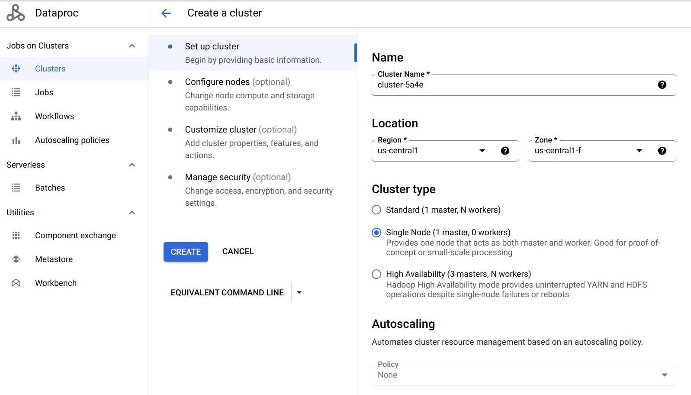

# Programming Homework 2: A Tour of Apache Spark

Gain a hands-on understanding of Google Cloud Dataproc, Apache Spark, Spark SQL, and Spark Streaming over HDFS.

Due: **April 29, 2022 4:59:59 PM**   

[Supplementary Material]({{ site.baseurl }})

## Overview

First introduced in [2010](https://www.usenix.org/legacy/event/hotcloud10/tech/full_papers/Zaharia.pdf), Apache Spark is one of the most popular modern cluster computing frameworks.

By leveraging its innovative distributed memory abstraction -- Resilient Distributed Datasets (RDDs) -- Apache Spark provides an effective solution to the I/O inefficiency of MapReduce, while retaining its scalability and fault tolerance.

In this assignment, you are going to deploy Spark and HDFS, write a Spark program generating a web graph from the entire Wikipedia, and write a PageRank program to analyze the web graph.

You will run those applications using Spark over HDFS in Google Cloud Dataproc.

Finally, you will write a stream emitter using Spark Streaming and a parser using Spark Structured Streaming to play with the recent trend of working with streaming data.

As a well-maintained open-source framework, Apache Spark has well-written official documents; you will find a lot of useful information by simply reading the official tutorials and documents.

When you encounter an issue regarding cluster deployment or write Spark programs, you are encouraged to utilize online resources before posting questions on Piazza.

## Learning Outcomes

After completing this programming assignment, students should be able to:

* Deploy and configure Apache Spark, HDFS in Google Cloud Dataproc.
* Write Spark applications using Python with Jupyter Notebook and launch them in the cluster.
* Describe how Apache Spark, Spark SQL, Spark Streaming, HDFS work, and interact with each other.

## Environment Setup
You will complete your assignment in Google Cloud Dataproc, which is a managed cloud service for Spark and Hadoop, which allows users to spin up Spark and Hadoop instances quickly.

First, make sure you have followed the [instructions](http://www.cs.columbia.edu/crf/cloud-cs/) provided by CRF to redeem your credits in Google Cloud.

Then, use the following [link](https://console.cloud.google.com/dataproc), and click on `Enable API` to enable Google Cloud Dataproc. __Note__: you could pin Dataproc on your navigation menu for quick access.

Click on `Create cluster` to create your first Dataproc Cluster. Notice there are three Cluster modes you could choose from: Single Node, Standard, and High Availability. We will start with a Single Node cluster.




#### Jupyter Notebook
You will use Python and Jupyter Notebook for this project. If you are unfamiliar with Jupyter Notebook, [this](https://towardsdatascience.com/jypyter-notebook-shortcuts-bf0101a98330) tutorial might be helpful.

Google provides an easy interface to install and access Jupyter notebook when creating Dataproc cluster. Go down to __Component gateway__ and select __Enable access to the web interfaces of default and selected optional components on the cluster__. Then click on `Advanced options`.


Go down to __Optional components__ and click on `Select component`. In the pop-up window, choose Anaconda and Jupyter Notebook (If you are using 2.0 Image Type such as 2.0-debian10, you don't need to choose Anaconda, it is pre-installed with miniconda, see [this](https://cloud.google.com/dataproc/docs/concepts/versioning/dataproc-release-2.0)). Make sure you click on `Select` to save your changes.


You could refer to [this](https://cloud.google.com/dataproc/docs/tutorials/jupyter-notebook) doc for more details. 

#### Cluster properties
Components like Spark and Hadoop have many configurations that users could tune. You could change the default values of those settings when creating the Dataproc cluster. Refer to [this](https://cloud.google.com/dataproc/docs/concepts/configuring-clusters/cluster-properties?hl=en_US&_ga=2.227749979.-739108073.1578339387) doc for a more detailed explanation. 
For example, if you want to change the default block size of HDFS to 64MB, you could change it by adding a cluster property under __Cluster properties__ in the Advanced Options section.


#### Optional Tip:
Since you will be working with Jupyter Notebooks on a dataproc cluster, it becomes important to save your notebook time and time again. This is needed to protect your work in case your cluster goes down for some reason. 

There are two ways to do this -- manual and ideal.
- Manual Method: Everytime you complete a significant portion of your task or whenever you stop/shut down your instance, manually download the jupyter notebook and save it on your local machine. Incase your notebook on the cluster VM gets corrupted, you can recover from your local machine.
- Ideal Method (recommended): This method involves attaching a cloud storage bucket with your dataproc cluster. This will allow dataproc to automatically save the notebook on a cloud storage bucket (whenever you save your notebook). Thus, you can always fetch your notebook from the bucket itself.

    #### Steps:
    - Create a cloud storage bucket with default configurations and any suitable name as per your preference. Follow [this](https://cloud.google.com/storage/docs/creating-buckets) for more details on how to create a bucket on GCP.
    - While creating a dataproc cluster, go to `Customize Cluster` and `Cloud Storage staging bucket`. Click `Browse` to select the bucket that you created in the previous step.
    
    
    __NOTE__: This step is optional but recommended. This is to prevent unforseen scenarios wherein you might lose all your progress because of a cluster failure.

## Part 1: Spark and Spark SQL

In this part of the assignment, you will perform 3 tasks

* Get yourself familiarized with the interface and ingesting a Wikipedia database into HDFS 
* Parse the Wikipedia database to generate a webgraph of the internal links
* Use the generated graph as an input to a Spark PageRank program to generate the ranks of the internal links.

## Task 1: Getting Started (10 Points)
Once you have created the cluster, you have full control over the VM, you could download any package you would need. Click on the cluster name to go to __Cluster details__ page. Go to the __VM Instances__ tab and click on __SSH__, run the following command to download all files to local HDFS. The files might take a while to transfer. In the meantime, [here](https://data-flair.training/blogs/top-hadoop-hdfs-commands-tutorial/) is a tutorial for HDFS commands which might be helpful.
```bash
hdfs dfs -cp gs://csee4121/homework2/enwiki_small.xml /
hdfs dfs -cp gs://csee4121/homework2/enwiki_test.xml /
hdfs dfs -cp gs://csee4121/homework2/enwiki_whole.xml /
```

You can also check your hdfs file through

```bash
hdfs dfs -ls /
```

Also, you would need an external package in order to parse XML files. You need to download  [spark-xml](https://libraries.io/maven/com.databricks:spark-xml_2.12) with version `2.12-0.14.0` to support Spark 3.1.2 and Scala 2.12 in  the default 2.0-debian10 image type when you create your cluster. You might need to run it on __all__ of your VMs if you have multiple machines in your cluster.

You can also download it to your local vm instance by the following command:

```bash
sudo hdfs dfs -get gs://csee4121/homework2/spark-xml_2.12-0.14.0.jar /usr/lib/spark/jars/
```
Now you could go to the __Web Interfaces__ tab and use the `Jupyter` link to open Jupyter Notebook Interface. 

In this task, we provide you a big Wikipedia database in XML format. It can be found at `/enwiki_whole.xml` in your HDFS.

This input file is very big and you have to use a distributed file system like HDFS to handle it. We have also provided a smaller file `/enwiki_small.xml` for debugging purposes. 

The XML files are structured as follow:

```xml
<mediawiki>
    <siteinfo>
        ...
    </siteinfo>
    <page>
        <title>Title A</title>
        <revision>
            <text>Some text</text>
        </revision>
    </page>
    <page>
        ...
    </page>
    ...
</mediawiki>
```

To get a sense of how a Wiki page transfers to a xml file, take a look at the following examples:

* [Apple (orig)](https://en.wikipedia.org/wiki/Apple)
* [Apple (xml)](https://en.wikipedia.org/wiki/Special:Export/Apple)

Note that the database we provide you is not up-to-date, but they should be pretty close to what you will find in the above examples.

### Submit a job
Once you are done with the debugging process on the Jupyter Notebook you could download it as a python file and submit it as a job to run on the cluster.  Here is a way to submit a job through google cloud console:


The following is an example job.


Notice you could specify python file to run from the Google Cloud Storage. Also, when you need to read the XML files, please make sure you have included the jar file. Besides, you could specify the number of cores and memory for driver and executor here. 


You could refer to [this](https://cloud.google.com/dataproc/docs/guides/submit-job) doc to learn more about submitting a job. You can also submit a job in other ways.


**Question 1.** (4 points) What is the default block size on HDFS? What is the default replication factor of HDFS on Dataproc?

Write a spark program to read in the `/enwiki_small.xml` file as a Dataframe and use printSchema() function to print its schema, you could start from something like following. Copy the outputted schema to a __separate txt file__ named __schema.txt__. (6 points)

```python
from pyspark.sql import SparkSession
spark = SparkSession.builder.getOrCreate()
df = spark.read.format('xml').options(rowTag='page').load('hdfs:/enwiki_small.xml')
```

If you are having trouble debugging your code using Jupyter, you could consider adding the following environment variable at the top of your notebook.

```python
import os
os.environ['PYSPARK_SUBMIT_ARGS'] = '--packages com.databricks:spark-xml_2.12:0.14.0 pyspark-shell'
```

Note that the notebook type should be Python 3, not PySpark.

### Best Practices ###

* Delete the cluster after you are done for a coding session, do not leave them on overnight. Otherwise you are going burn through credits really quickly.
* Start from small. Start with small files and use one node setup to debug your code. Then try to run your code on bigger files and three-node setup.
* It is recommended to use Jupyter Notebook to debug your code. But do make sure you have shutdown all of your Jupyter notebooks before you submit your job using the web interface.
* Notice it is possible to use Google Cloud Storage 


### Task 2: Webgraph on Internal Links (50 Points)

You are going to write a Spark program which takes the xml file you ingested as input, and generate a csv file which describes the webgraph of the internal links in Wikipedia. The csv file should look like the following:

```csv
article1	article0
article1	article2
article1	article3
article2	article3
article2	article0
...
```

It is hard and tedious to find every internal link on a page. We have made the following assumptions to simplify the string parsing for you. For each page element, the article on the left column corresponds to the string between `<title>` and `</title>`, while the article on the right column are those surrounded by a pair of double brackets `[[ ]]` in the `<text>` field in the xml file with the following requirements:

1. All the letters should be convert to lower case.
2. If the internal link contains a `:`, you should ignore the entire link unless it starts with `Category:`.
3. Ignore links that contain a `#`.
4. If multiple links appear in the brackets, take the first one; e.g., take `A` in `[[A|B]]`.

Those assumptions help you filter out some unnecessary links. Note if the remaining string becomes empty after the filtering, you should also ignore them. When we say ignoring a link, we mean it will not show up in the output file of this task.

The two columns in the output file should be separated by a `Tab`. You may assume there are no other `Tab`s in the article name.

__Note__: It is recommended to use UDF + regular expression to extract links from the documents. Also, try to use the built in functions of spark to sort your results. 

**You should use the default configuration of Spark, HDFS, unless we specify a different one.** 

Set the **Spark driver memory** to 1GB and the **Spark executor memory** to 5GB to answer Question 2-4.

For the following questions you will need to use the xmls as the input file, and output columns into a CSV file. Separate the columns with a `Tab`.

**Question 2.**  (2 points) Use `enwiki_test.xml` as input and run the program locally on a Single Node cluster using 4 cores. Include your screenshot of the dataproc job. What is the completion time of the task?

**Question 3.** (2 points) Use `enwiki_test.xml` as input and run the program under HDFS inside a 3 node cluster (2 worker nodes).  Include your screenshot of the dataproc job. Is the performance getting better or worse in terms of completion time? Briefly explain.

**Question 4.** (2 points) For this question, change the default block size in HDFS to be 64MB and repeat Question 3.   Include your screenshot of the dataproc job.  Record run time, is the performance getting better or worse in terms of completion time? Briefly explain.

Set the **Spark driver memory** to 5GB and the **Spark executor memory** to 5GB to answer Question 5-7. Use this configuration across the entire assignment whenever you generate a web graph from `enwiki_whole.xml`.

**Question 5.** (2 points) Use `enwiki_whole.xml` as input and run the program under HDFS inside the Spark cluster you deployed. Record the completion time. Now, kill one of the worker nodes immediately. You could kill one of the worker nodes by go to the __VM Instances__ tab on the Cluster details page and click on the name of one of the workers. Then click on the STOP button. Record the completion time. Does the job still finish? Do you observe any difference in the completion time? Briefly explain your observations.  Include your screenshot of the dataproc jobs.


**Question 6.** (2 points) Only for this question, change the replication factor of `enwiki_whole.xml` to 1 and repeat Question 5 without killing one of the worker nodes.  Include your screenshot of the dataproc job. Do you observe any difference in the completion time? Briefly explain.

**Question 7.** (2 points) Only for this question, change the default block size in HDFS to be 64MB and repeat Question 5 without killing one of the worker nodes.  Record run time,  include your screenshot of the dataproc job. Is the performance getting better or worse in terms of completion time? Briefly explain.

Besides answering these questions in README,  you also need to submit the code. You need to use `enwiki_small.xml` as the input file, and sort both output columns in ascending order and save the first 5 rows into a CSV file and name it p1t2.csv. Separate the columns with a `Tab`. (28 points for code + output, 10 points for correctness of the approach)


### Task 3: Spark PageRank (40 Points)

In this task, you are going to implement the PageRank algorithm, which Google uses to rank the website in the Google Search. We will use it to calculate the rank of the articles in Wikipedia. The algorithm can be summarized as follows:

1. Each article has an initial rank of 1.
2. On each iteration, the contribution of an article A to its neighbor B is calculated as `its rank / # of neighbors`.
3. Update the rank of the article B to be `0.15 + 0.85 * contribution`
4. Go to the next iteration.

The output should be a `csv` file containing two columns.
The first column is the article and the other column describes its rank.
Separate the columns with a `Tab`.

Set the Spark driver memory to 5GB and the Spark executor memory to 5GB whenever you run your PageRank program. Write a script to first run Task 2, and then run Task 3 using the csv output generated by Task 2, and answer the following questions. Always use 10 iterations for the PageRank program. When running Task 2, use `enwiki_whole.xml` as input.

**Question 8.** (2 points)  Use your output from Task 2 with `enwiki_whole.xml` as input, run Task 3 using a 3 node cluster (2 worker nodes). Include your screenshot of the dataproc job.  What is the completion time of the task? 

To submit the code part of the assignment you will need to use `enwiki_small.xml` as the input file for Task 2 and then run your code for Task 3, and sort both output columns for Task 3 in ascending order and save the first 5 rows into a CSV file and name it p1t3.csv. Separate the columns with a `Tab`. (28 points for code + output, 10 points for correctness of the approach)

## Part 2: Spark Streaming (20 Extra Credits)

In the second part of the assignment, you will learn Spark Streaming as well as Spark Structured Streaming, and write a program for each of them.

Spark Streaming is an extension of the core Spark API that enables scalable, high-throughput, fault-tolerant stream processing of live data streams.


Internally, Spark Streaming receives live input data streams and divides the data into batches, which are then processed by the Spark engine to generate the final stream of results in batches. More information about Spark Streaming can be found [here](https://spark.apache.org/docs/latest/streaming-programming-guide.html).


Spark Structured Streaming is a new high-level API introduced after Apache Spark 2.0 to support continuous applications. It provides fast, scalable, fault-tolerant, and end-to-end exactly-once stream processing without the user having to reason about streaming. The key idea here is to treat a live data stream as a table that is being continuously appended. You are encouraged to read its [programming guide](https://spark.apache.org/docs/latest/structured-streaming-programming-guide.html).


### Task 1: Stream Receiver (10 points)

In this task, you are going to write a stream receiver using **Spark Structured Streaming** to read file source while the file is being generated. The input source should be `csv` files. Your receiver should keep a list of articles whose rank is greater than **0.5** and store the file inside the HDFS. The list should be updated dynamically while the Pagerank program is dumping the output and should be saved inside the HDFS.

The output file should be `csv` whose the format should look like the following. Separate the columns with a `Tab`. To submit, only submit your Jupyter notebook files.  (8 points for code)

__Note__: It might be helpful to create your own csv to test or debug the code. If your stream receiver is running then it should generate output.

```
article0	rank0
article1	rank1
article2	rank2
...
```

**Question 9** (2 points) Start a PageRank program you wrote in Part 1 Task 3 whose input is the link graph generated from "enwiki_whole.xml" and store the output to a directory inside HDFS. Set your stream receiver to read the files generated by the PageRank program. Kill the receiver when the PageRank task is finished. How many articles in the database has a rank greater than **0.5**? You can SSH into the master node and start with 'hdfs dfs -mv' or 'mv' to help you write your program. 


### Task 2: Stream Emitter (10 points)

In this task, you are going to write a stream emitter using **Spark Streaming** to emit the 'txt' file output generated by the PageRank program to a directory to emulate the case you see in the previous task. Run your stream receiver to catch the stream you are emitting and check if you get the same result as in Question 9. 

To submit, include your Jupyter notebook files.  (6 points for code)

**Question 10** (2 points) Spark Streaming can also be used to send data via TCP sockets. The Emitter in this case will wait on a socket connection request from the receiver, and upon accepting the connection request it will start sending data. Do you think such data server design is feasible and efficient? Briefly explain.

**Questions 11** (2 points) How many hours did you spend in this assignment?

## Submission Instructions

### File name

Each group should submit one zip file to Gradescope.
Only one teammember need to submit the file, make sure the team members are assigned to the submission.

Name the file as `<UNI-1>_<UNI-2>.zip`.
For example, `slj2142_rc3374.zip`.

### Content - Code

4 Spark projects from Part 1 Task 2-3 and Part 2 Task 1-2 should goes under folder names
`p1t2`, `p1t3`, `p2t1`, `p2t2` accordingly.

Inside each folder, in addition to Jupyter notebook and python files, there should be an additional file named `config` which describes configurations or addition step you did to run the three tasks mentioned below.

You also need to provide a `config` file which describes configurations or addition step you did to run the **following 3 tasks on a single Spark node **

1. Use the program in Part 1 Task 2 to take "*enwiki_small.xml*" as input to generate the graph.
2. Use the program in Part 1 Task 3 to take the graph you just generated and output a rank list of the articles in the dataset.
3. (Optional) Use the stream emitter you wrote in Part 2 Task 2 to emit the rank list output in the previous step to a local directory while using the stream receiver you wrote in Part 2 Task 1 to dynamically read the files and generate the output mentioned in Part 2 Task 1.

Try to be clear about the instructions to run these steps. The purpose of doing this is to check if your program does what we mentioned in the spec. Do not worry whether your program has the lowest completion time.

The structure should be something like

```plain
g1.zip
├── p1t1
│	├── schema.txt
├── p1t2
│   ├── config
│   ├── p1t2.py
│   ├── p1t2.csv
|   ├── p1t2.ipynb
├── p1t3
├── p2t1
├── p2t2
└── README (see below)
```

### Content - README

Each submission should also include a README to record the answers to the 11 (last 3 optional) questions mentioned in this assignment.


## Acknowledgements

This assignment is based on Peifeng Yu and Mosharaf Chowdhury's UMICH EECS598: Advanced Topics on Systems for X.
